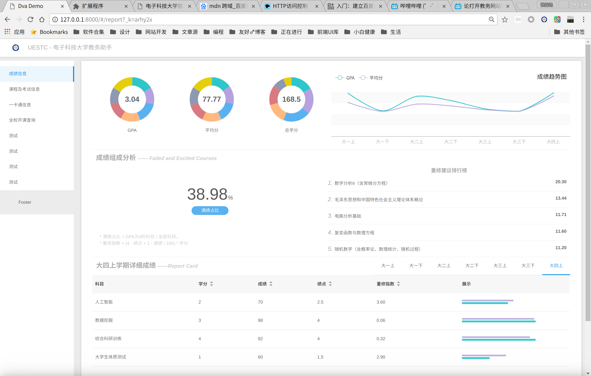
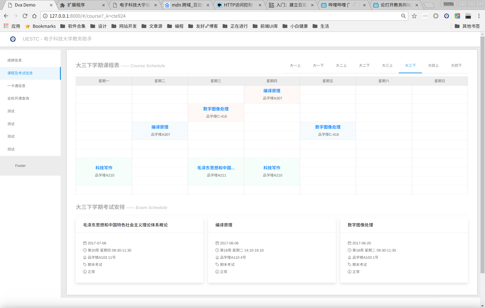
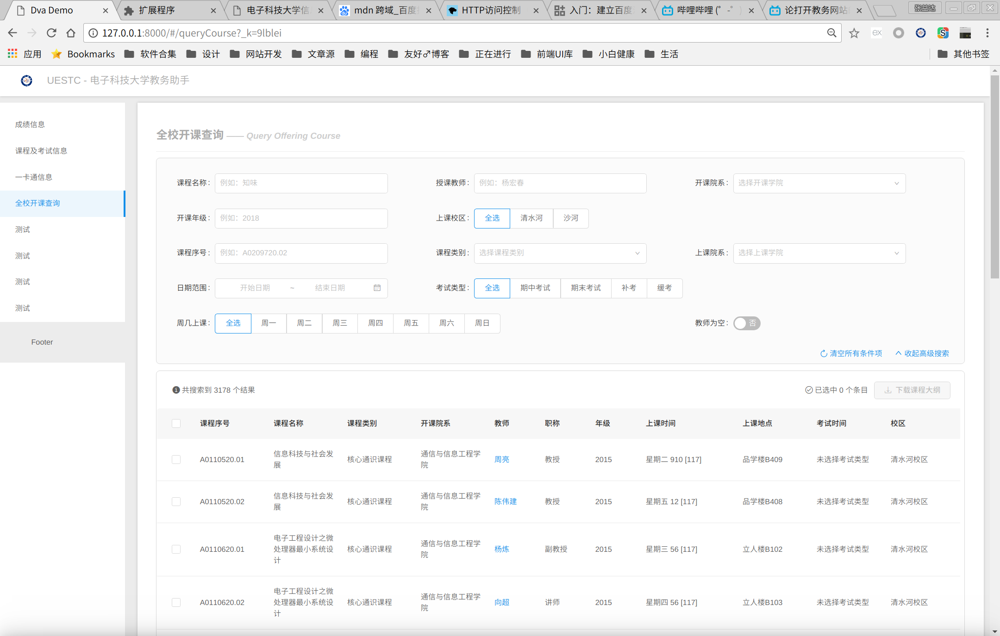
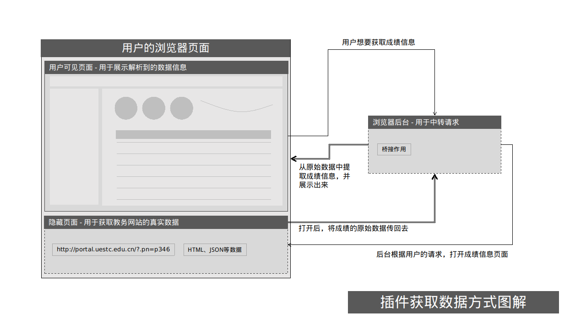

## 插件功能说明

此插件用于美化教务系统的信息展示，美化的内容包括成绩信息、课程安排、考试安排、全校开课查询、一卡通信息（未完成）、评教信息等等。此插件运用Chrome浏览器的通讯机制，直接对从教务系统的网页中爬取所需信息，具有很强的扩展性，并且所有的解析操作都是在用户的浏览器完成，保证用户的信息不会泄露。

下面是一些截图：

## 插件机制介绍

下面本文将介绍插件实现的机制，尽量不涉及到具体的实现细节，使用通俗易懂的语言进行说明。

Chrome插件是目前构建GUI应用成本最低的方式，得益于Chrome浏览器极高的市场占有率，通过Chrome插件发布的应用可以很方便地安装使用，并通过Chrome向开发者开放的强大API实现很多方便的功能。有关Chrome插件的更多介绍，可以参考这里：https://chajian.baidu.com/developer/extensions/getstarted.html 。

在介绍本插件的运行机制之前，首先要先明确几点前端领域的知识：

1. 浏览器为了保护用户数据安全，引入了[HTTP访问控制](https://developer.mozilla.org/zh-CN/docs/Web/HTTP/Access_control_CORS)(简称CORS)手段。举例说明：小明登录了 baidu.com，并留下了很多搜索记录，然后小明又去浏览了一个恶意网站 sb.com ，如果没有CORS做限制， sb.com 就可以往 baidu.com 发送任意查询请求，从而获取到小明在baidu上的搜索记录，小明的隐私就泄露了。而CORS限制规定了，除非目标网站允许，用户在浏览 a.com 时，页面上所有的请求，都只能用来访问 a.com 域名下的服务器，否则统统拦截掉；
2. 浏览器会保存服务器分配给用户的Cookie数据，当用户再次访问服务器时，所发出的请求都会附带上该Cookie信息，服务器通过解析Cookie信息，就可以鉴定用户的身份，所以Cookie一般都用来作登录后的身份验证，学校的教务系统也不例外。

介绍完CORS和Cookie后，就可以说一说为什么要将插件的机制设置成上图所示的那样了。

在插件最开始的版本中，遇到的第一个问题就是如何保存用户的Cookie信息，当时采用的方式是，直接在原网页上进行开刀，当用户安装上插件后，一旦检测到用户访问了学校的教务网站，浏览器就会运行一个脚本，这个脚本会将用户看到的教务网站内容统统清除掉，然后替换上事先准备好的新的页面内容，这样通过“狸猫换太子”，虽然用户依然在访问教务网站，但是看到的信息已经是插件美化后的内容了，插件此时也可以直接访问教务网站中的所有数据，浏览器会将用户的Cookie信息处理妥当。

这样的架构没有太大的问题，运作很良好，发布了这么久也没有出太大的BUG，[这个视频](https://www.bilibili.com/video/av6874596/)介绍了第一版插件的功能。

直到我着手整合一卡通的信息时，我发现一卡通的服务器和教务系统不在同一个域下，受到CORS的限制，我没法直接获取到一卡通的信息了。经过一番调整，我将架构调整到现在的样子，既然我不能像以前那样直接在页面上动刀了，那我就用浏览器的后台做一个中转，每次用户打开插件，浏览器都会新建两个隐藏窗口，一个是教务系统，一个是一卡通门户，插件可以通过与浏览器后台交互从而分别获取到教务系统和一卡通门户上的数据，问题就这样解决了。

## 目前插件的完成度如何

下面是一个功能清单：

- [x] 成绩展示
- [x] 重修分析
- [x] 考试安排
- [x] 课程安排
- [x] 全校开课查询
- [ ] 一卡通数据展示
- [ ] 评教操作
- [ ] ...等等

理论上教务系统的所有功能都能重写一遍，所以我很期待各位有兴趣的同学加入。  

无论你在插件的使用逻辑、UI设计还是其他什么地方遇到了问题，都可以在仓库的[ISSUE区](https://github.com/Yidadaa/UESTC_Helper/issues)发布ISSUE进行吐槽。

## 其他说明

采用到的技术栈：
- 最基础的HTML、CSS和Javascript；
- 前端框架[Ant Design](https://ant.design/index-cn)以及配套的全套脚手架工具；
- 图标库[E-Charts](http://echarts.baidu.com/index.html)。

我可以为该项目做些什么？
- 吐槽；
- 为看着不顺眼的页面提供更好的设计图;
- 为看着不顺眼的页面贡献更好的代码;
- 告诉开发者你想要的新功能。